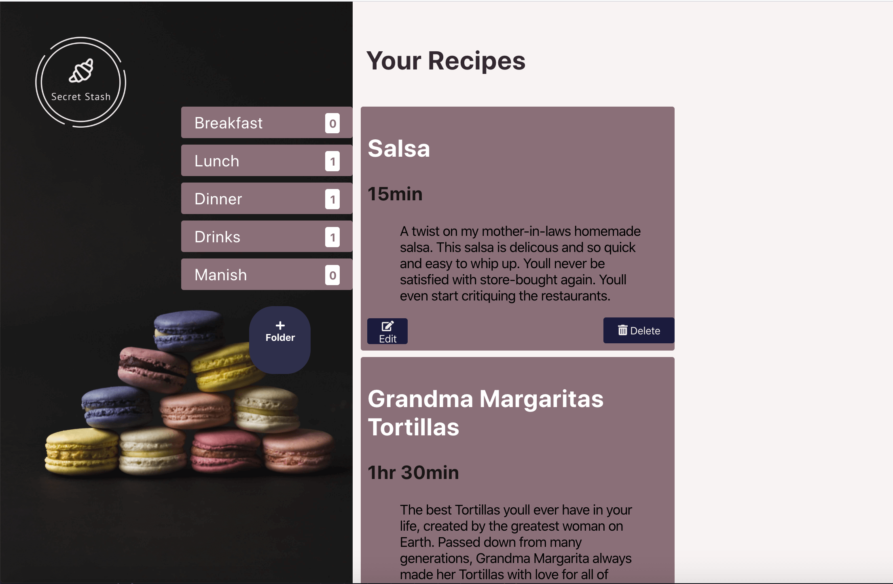
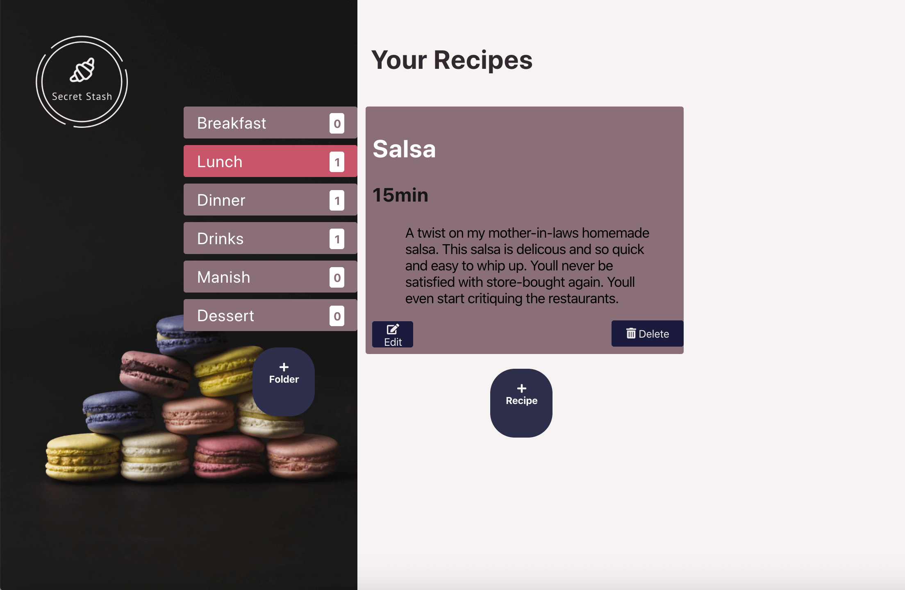
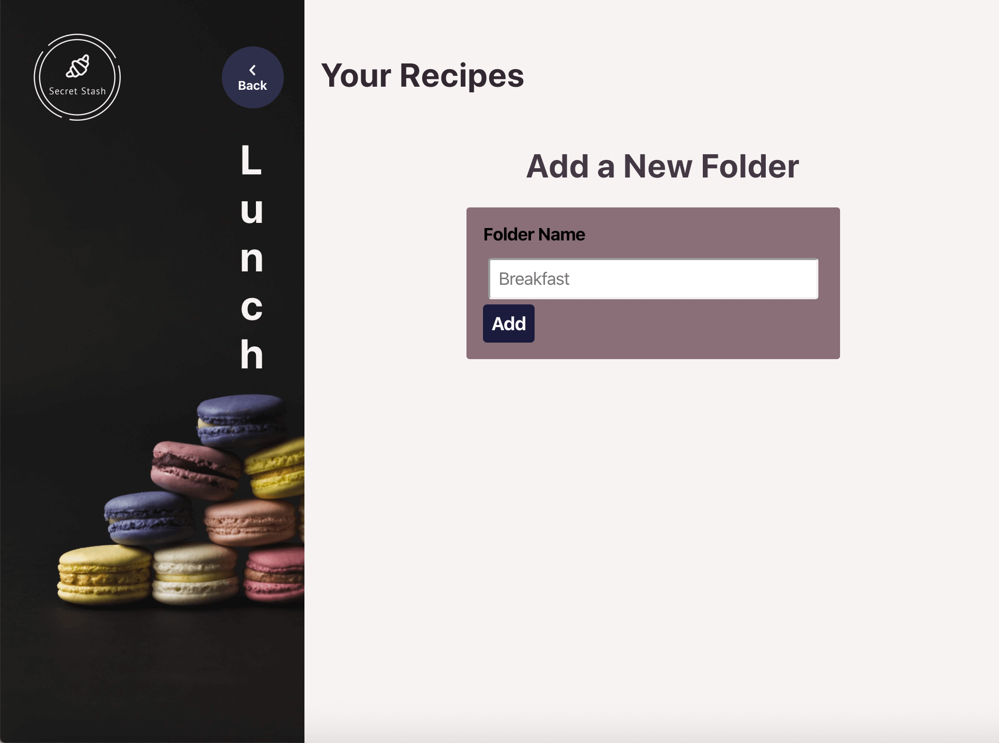
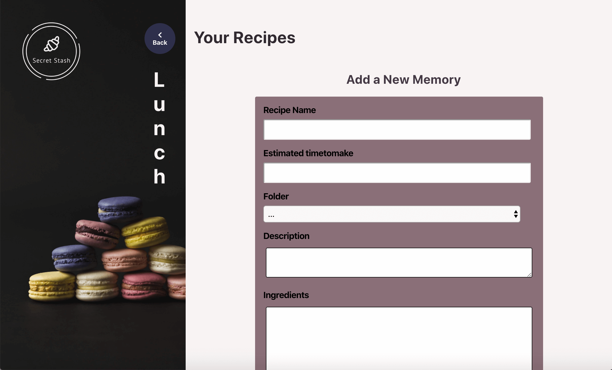
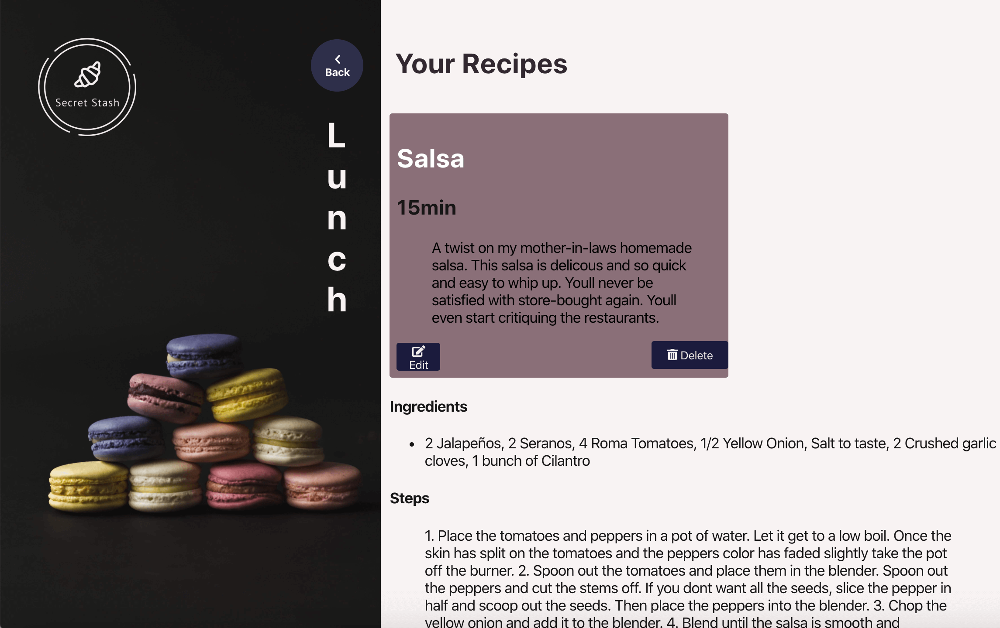
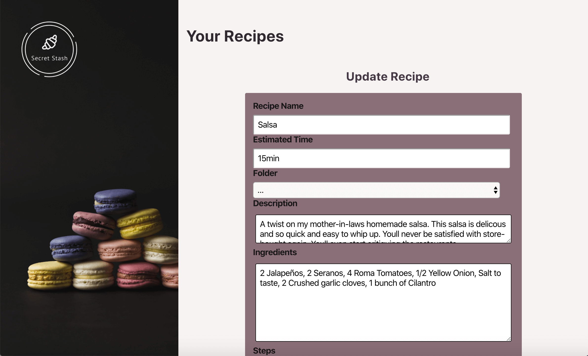

# Secret Stash

[link to live app](https://secretstash-app.now.sh/home "Link to Secret Stash app homescreen").

## Organized

> Organize all of your recipes in one simple place. View all of your recipes on the main page.
> 
> Or select a specific folder to view the folder's recipes.
> 

### Add Folders

> Easily add a new folder to organize your recipes how you choose.
> 

### Add Recipes

> Add your recipes and easily choose what folder you want them stored in.
> Save your recipes in a database, instead of a box in your home to
> preserve your memories and share easier with family and friends.
> 

### View a specific Recipe, Edit and Delete recipes.

> Select a recipe to view the ingredients and steps. You can also delete a recipe from the main Recipe list
> screen or from the specific recipe's screen.
> 

### Edit Recipes

> Edit your recipes with ease.
> 
